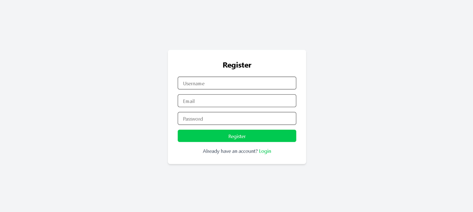
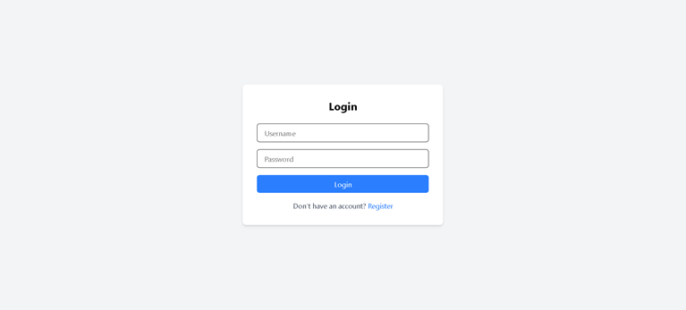

# 📝 Todo App (React + Django REST API)

A full-stack Todo application built using **React.js** for the frontend and **Django REST Framework** for the backend.  
This application allows users to create, update, delete, and manage daily tasks efficiently through a RESTful API.

---

## 🚀 Features

- ➕ Add new tasks
- ✏️ Edit existing tasks
- ✅ Mark tasks as completed
- 🗑️ Delete tasks
- 🔄 Dynamic frontend updates using API integration
- 📦 RESTful backend built with Django REST Framework

---

## 🛠️ Tech Stack

### Frontend
- React.js
- Axios
- HTML5
- CSS3

### Backend
- Django
- Django REST Framework
- SQLite (Default Database)

---

## 📂 Project Structure
todo-app/
│
├── backend/myproject # Django REST API
│ ├── manage.py
│ ├── todo/
│ ├── requirements.txt
│ └── db.sqlite3
│
├── frontend/ # React Application
│ ├── src/
│ ├── public/
│ └── package.json
│
└── README.md

API ENDPOINTS
| Method | Endpoint         | Description        |
| ------ | ---------------- | ------------------ |
| GET    | /api/todos/      | Retrieve all tasks |
| POST   | /api/todos/      | Create a new task  |
| PUT    | /api/todos/<id>/ | Update a task      |
| DELETE | /api/todos/<id>/ | Delete a task      |

Images

Roshan Poudel
Electronics and Computer Engineering Student